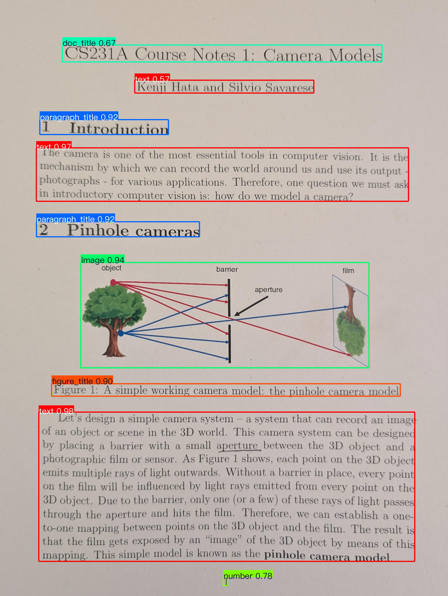
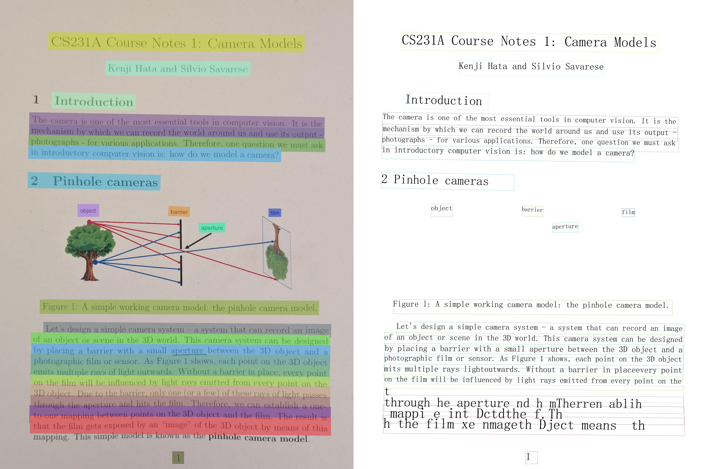
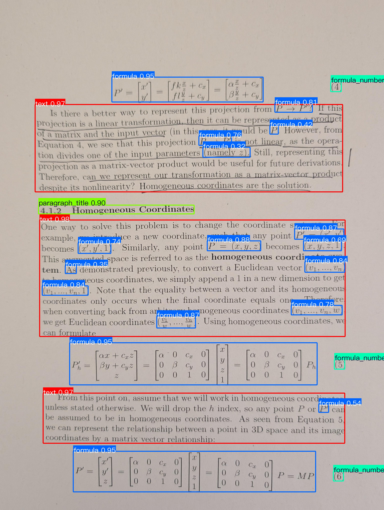
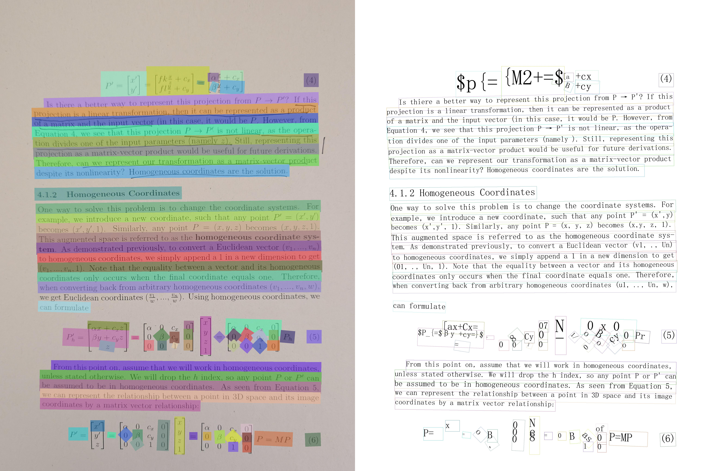
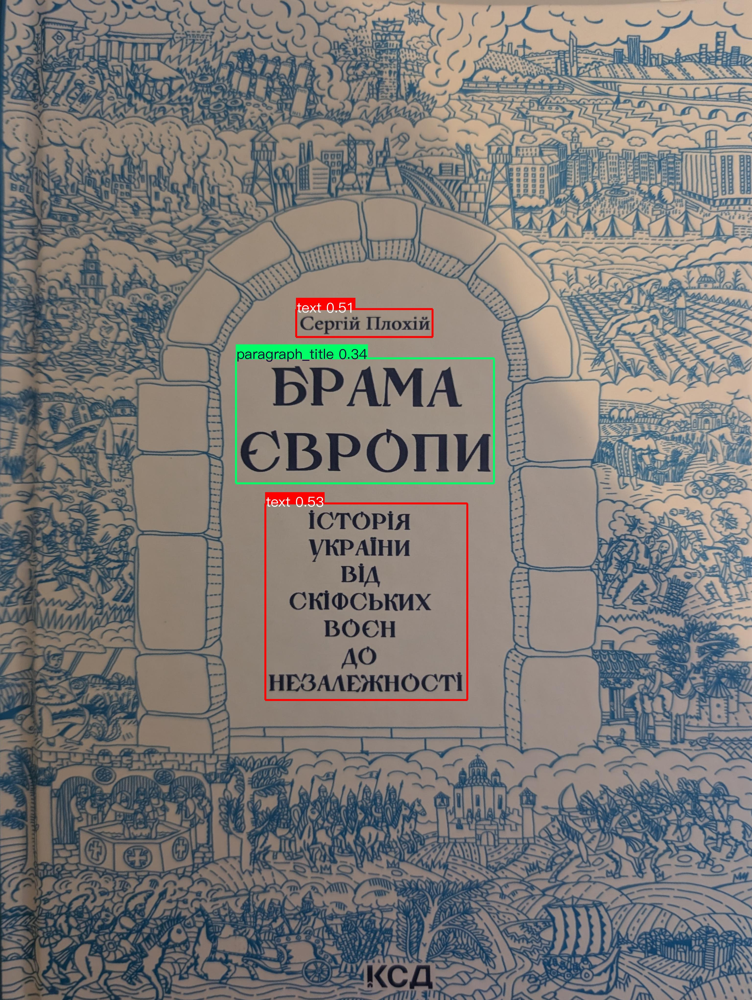
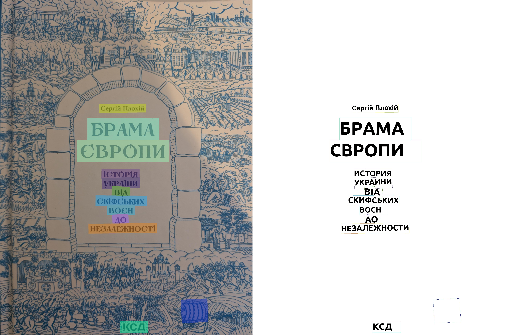
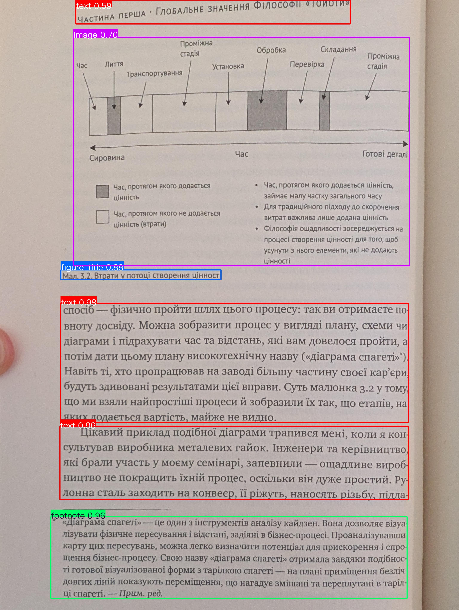
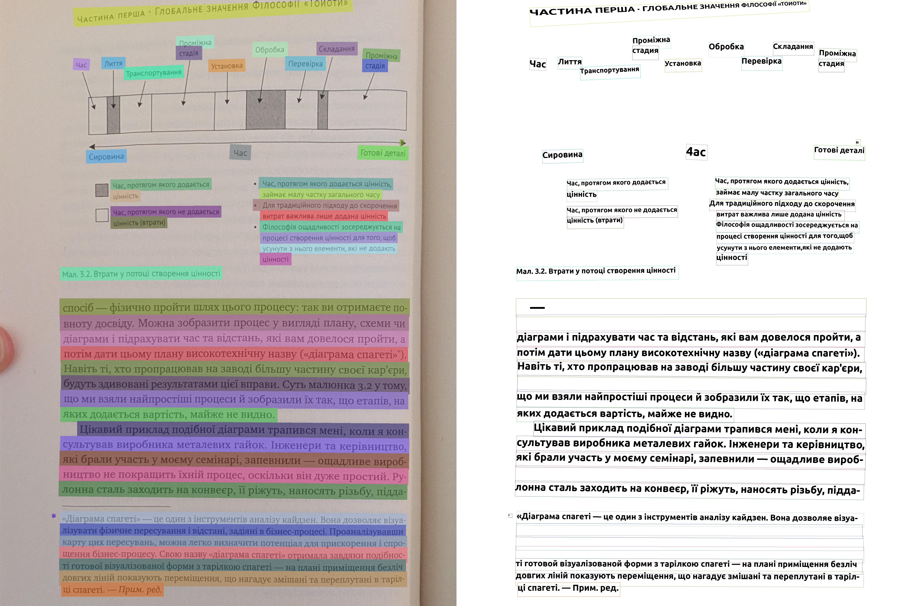

# doc-lite — Structured OCR Pipeline

## What is this?

A simple, ready-to-run starting point for experimenting with modern neural document OCR. It sits between classical OCR tools (Tesseract) and full VLM pipelines, more accurate than traditional approaches, but without the complexity of a large framework.

Built on top of [PaddleOCR](https://github.com/PaddlePaddle/PaddleOCR) and [PaddleX](https://github.com/PaddlePaddle/PaddleX), which are powerful but complex. This project wraps the relevant parts into a single, easy-to-understand Python script so you can start experimenting immediately.

**Supports:** English, Ukrainian and *all other from PaddleX (but first you must export to onnx)*.

**Produces:** layout visualisations · structured JSON · Markdown · Excel (with table recognition)

---

## vs PaddleX / PaddleOCR

| | PaddleX | doc-lite |
|---|---|---|
| RAM | All models loaded eagerly at startup | Lazy ONNX sessions + `lite` / `full` / `ocr-only` modes |
| Language routing | Manual config per language | Auto-maps `uk` → cyrillic checkpoint |
| Image quality | — | `pyiqa` hook for quality-conditioned routing |
| Setup | Full framework install | Single script, local checkpoints, offline-first |

---

## Installation

```bash
python -m venv .venv && source .venv/bin/activate
pip install -r requirements.txt
```

Download model checkpoints from [GDrive](https://drive.google.com/drive/u/0/folders/1ddX_sX7rDZbaOLPUMyUoDMq6seeTUvpT) and place them in `checkpoints/` at the project root.

---

## Quick Start

```bash
python simple_ocr_struct_pipeline.py --mode lite
```

Results are saved to `out/results-lite/{lang}/{image_name}/`.

---

## Pipeline Modes

```python
PIPELINE_CONFIGS = {
    "full":     "PP-StructureV3",                          # all features
    "lite":     "configs/pipelines/PP-StructureV3-lite.yaml",  # text + layout
    "ocr-only": "configs/pipelines/PP-StructureV3-lite.yaml",  # plain text
}
```

| Mode | RAM | Layout | Tables | Formulas | Best for |
|---|---|---|---|---|---|
| `full` | ~3–4 GB | ✓ | ✓ | ✓ | Full document analysis |
| `lite` | ~1 GB | ✓ | ✗ | ✗ | Low-RAM machines |
| `ocr-only` | ~600 MB | ✗ | ✗ | ✗ | Plain text extraction |

Run with explicit mode:

```bash
python simple_ocr_struct_pipeline.py --mode full
python simple_ocr_struct_pipeline.py --mode lite
python simple_ocr_struct_pipeline.py --mode ocr-only
```

---

## Output

Each processed image gets its own directory containing:

| File | Description |
|---|---|
| `layout_det_res.jpg` | Detected layout blocks |
| `region_det_res.jpg` | Fine-grained region detection |
| `overall_ocr_res.jpg` | OCR text box overlay |
| `layout_order_res.jpg` | Reading order visualisation |
| `*_res.json` | Full structured result (blocks, text, coordinates) |
| `*.md` | Markdown document with embedded images |
| `*.xlsx` | Excel export (`full` mode with tables only) |

---

## Image Quality Assessment — Production Extension

[pyiqa](https://github.com/chaofengc/IQA-PyTorch) is integrated as an optional quality gate. Enable it in the script:

```python
USE_IMG_QUALITY_ASSESMENT = True  # bottom of simple_ocr_struct_pipeline.py
```

The model returns a normalised score (0.0 = poor, 1.0 = excellent):

```python
score = iqa_model.predict(img_bgr=img)
# route low-quality images → heavy VLM
# route high-quality images → lite OCR pipeline
```

Supported models: `musiq`, `brisque`, `hyperiqa`, `ilniqe`, `liqe`, `topiq_nr`.

This pattern makes it easy to build a production system that uses lightweight OCR for clean scans and falls back to a VLM only when image quality is too low for reliable OCR.

---

## Appendix: Example Results

### English Documents

**Document 1 — Layout detection & OCR overlay**

| Layout Detection | OCR Overlay |
|---|---|
|  |  |

**Document 2 — Page with formulas (detected as image regions in lite mode)**

| Layout Detection | OCR Overlay |
|---|---|
|  |  |

---

### Ukrainian Documents

**Document 1**

| Layout Detection | OCR Overlay |
|---|---|
|  |  |

**Document 2 — Page with embedded image**

| Layout Detection | OCR Overlay |
|---|---|
|  |  |

---

## Acknowledgements

This project is built on top of excellent open-source work:

- **[PaddleOCR](https://github.com/PaddlePaddle/PaddleOCR)** — text detection and recognition models
- **[PaddleX](https://github.com/PaddlePaddle/PaddleX)** — layout detection, table recognition, document preprocessing pipelines
- **[pyiqa](https://github.com/chaofengc/IQA-PyTorch)** — image quality assessment models
