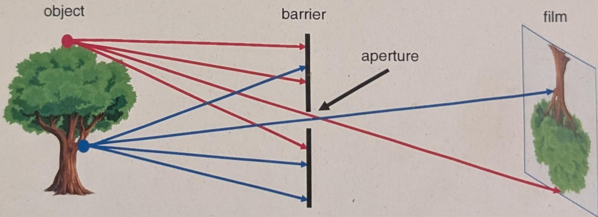

# CS231A Course Notes 1: Camera Models 

Kenji Hata and Silvio Savarese 

## I ntroduction 

The camera is one of the most essential tools in computer vision. It is the mechanism by which we can record the world around us and use its output photographs - for various applications. Therefore, one question we must ask in introductory computer vision is: how do we model a camera?

## 2 Pinhole cameras 

Figure l: A simple working camera model: the pinhole camera model.

Let's design a simple camera system - a system that can record an image of an object or scene in the 3D world. This camera system can be designed by placing a barrier with a small aperture between the 3D object and a photographic film or sensor. As Figure 1 shows, each point on the 3D object mits multiple rays lightoutwards. Without a barrier in placeevery point on the film will be influenced by light rays emitted from every point on the t through he aperture nd h mTherren ablih  mappi e int Dctdthe f.Th h the film xe nmageth Dject means  th 