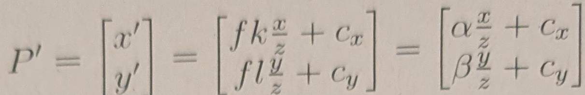
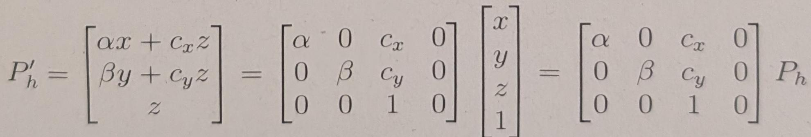
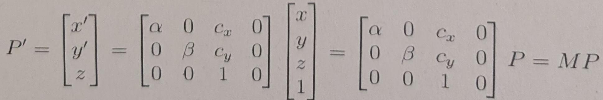

{M2+=$ 

Is thiere a better way to represent this projection from P → P'? If this projection is a linear transformation, then it can be represented as a product of a matrix and the input vector (in this case, it would be P. However, from Equation 4, we see that this projection P → P' is not linear, as the operation divides one of the input parameters (namely ). Still, representing this projection as a matrix-vector product would be useful for future derivations.Therefore, can we represent our transformation as a matrix-vector product despite its nonlinearity? Homogeneous coordinates are the solution.

#### 4.1.2 Homogeneous Coordinates 

One way to solve this problem is to change the coordinate systems. For example, we introduce a new coordinate, such that any point P' = (x',y)becomes (x',y', 1). Similarly, any point P = (x, y, z) becomes (x,y, z, 1).This augmented space is referred to as the homogeneous coordinate system. As demonstrated previously, to convert a Euclidean vector (v1, ., Un)to homogeneous coordinates, we simply append a 1 in a new dimension to get (01, ., Un, 1). Note that the equality between a vector and its homogeneous coordinates only occurs when the final coordinate equals one. Therefore,when converting back from arbitrary homogeneous coordinates (u1, .., Un, w),can formulate 

From this point on, assume that we will work in homogeneous coordinates,unless stated otherwise. We will drop the h index, so any point P or P' can be assumed to be in homogeneous coordinates. As seen from Equation 5,we can represent the relationship between a point in 3D space and its image coordinates by a matrix vector relationship:

