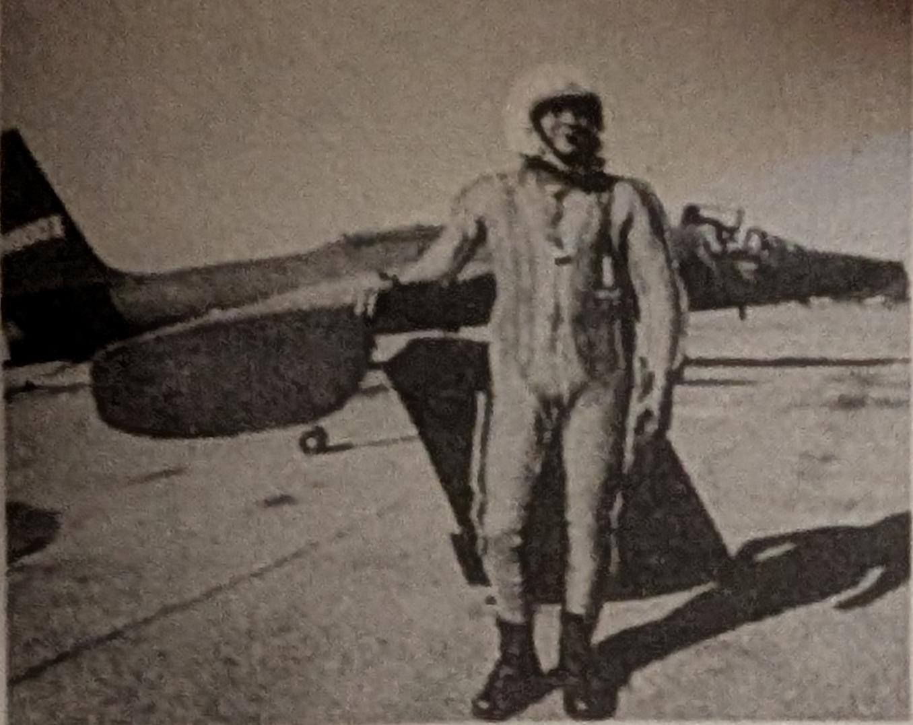
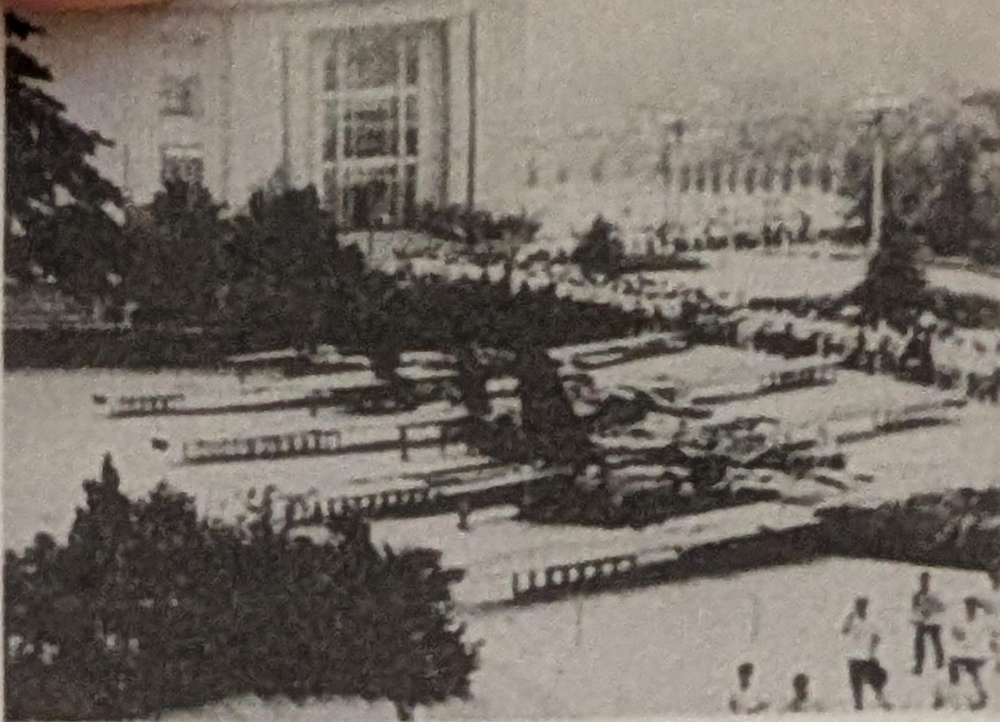
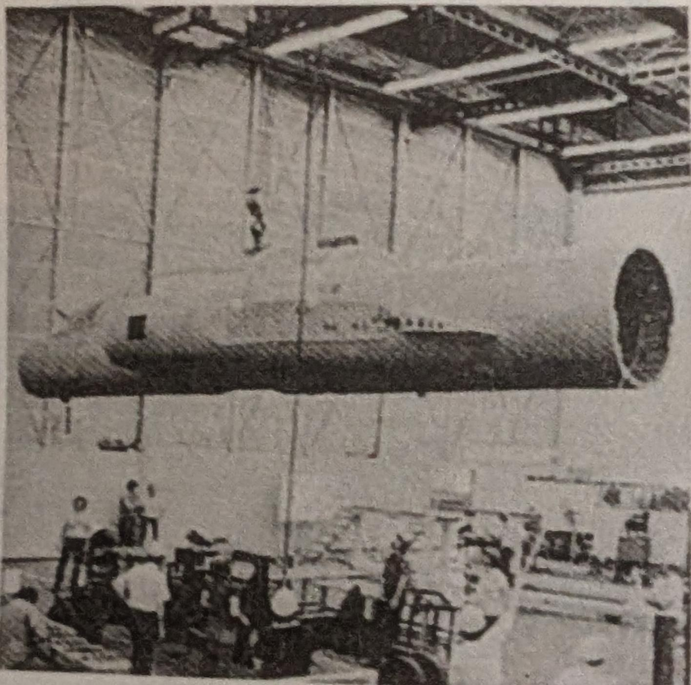
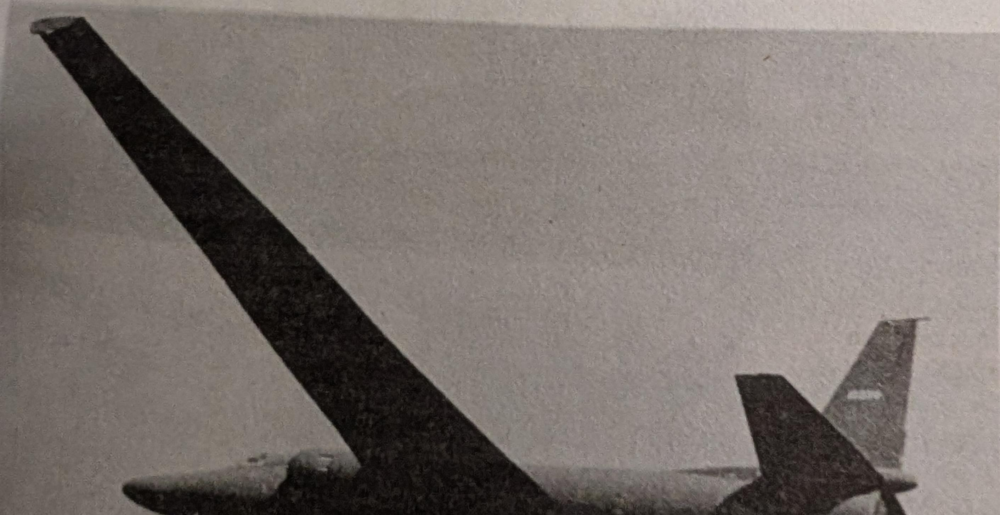

Above: Four downed Taiwanese U-2s on display in Peking public park in 1966. (Life Magazine) 

Above: U-2 pilot Francis Gary Powers as a Skunk Works test pilot in 1970, following his release from Soviet prison. (Lockheed)

Below: U-2 spy plane. (Lockheed)

Right: A U-2 being assembled at the Skunk Works in the late 1950s. (Lockheed) 

