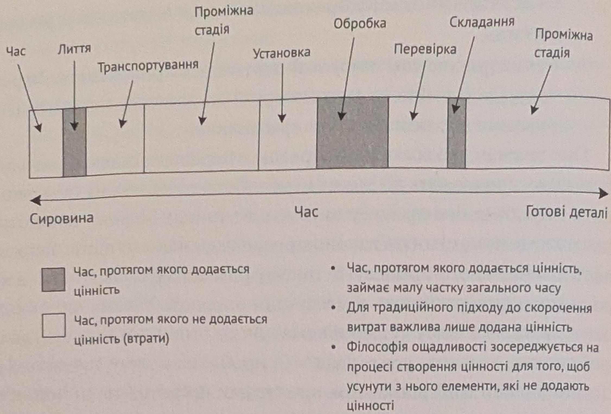

ЧАСТИНА ПЕРША · ГЛОБАЛЬНЕ ЗНАЧЕННЯ ФІЛОСОФІЇ «ТОИОТИ»

Мал. 3.2. Втрати у потоці створення цінності

    —       діаграми і підрахувати час та відстань, які вам довелося пройти, апотім дати цьому плану високотехнічну назву («діаграма спагеті»).Навіть ті, хто пропрацював на заводі більшу частину своєї кар'єри,    що ми взяли найпростіші процеси й зобразили їх так, що етапів, наяких додається вартість, майже не видно.

Цікавий приклад подібної діаграми трапився мені, коли я консультував виробника металевих гайок. Інженери та керівництво,які брали участь у моєму семінарі, запевнили — ощадливе вироб   лонна сталь заходить на конвеєр, її ріжуть, наносять різьбу, підда