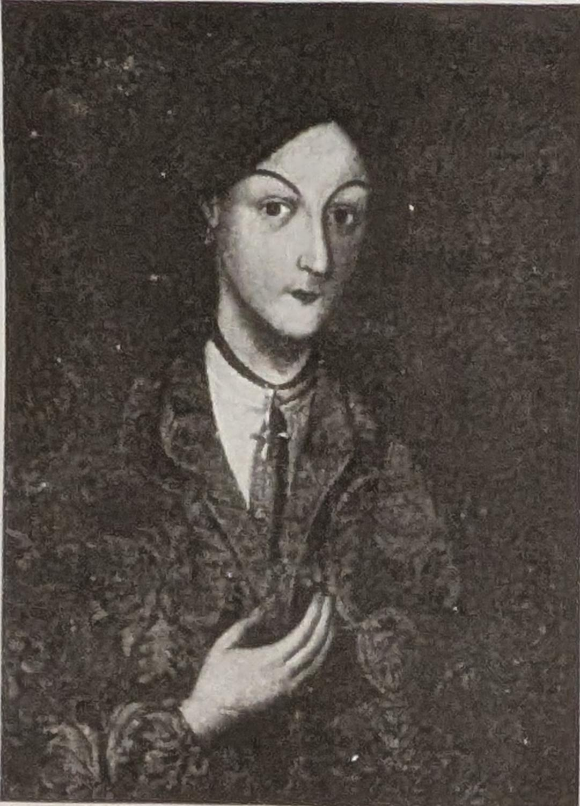
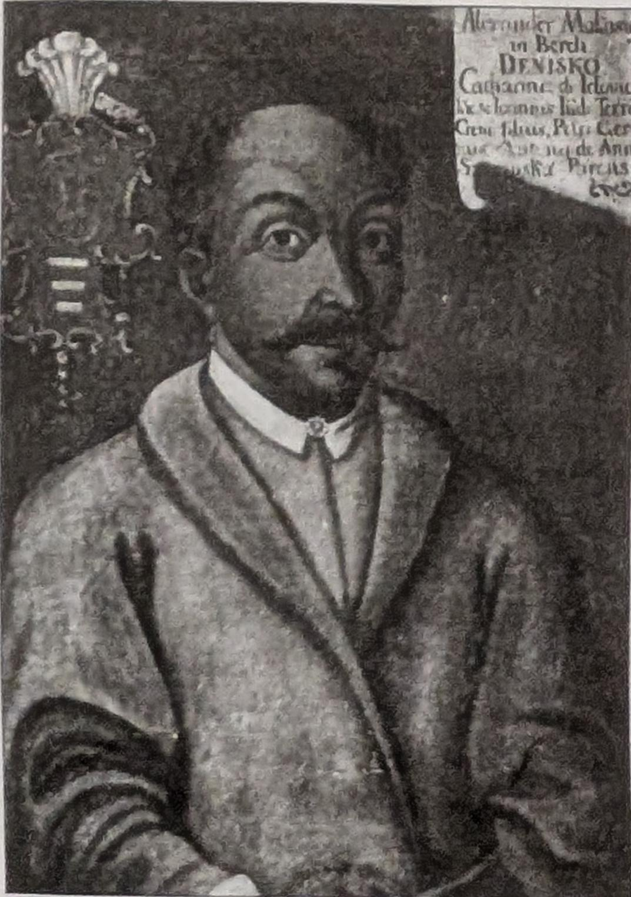

Портрет дружини

Прилуцького

полковника

Дарагана.

Sereдиna 

XVIII ст.

ПортретОлександраДениска.XVIII сm.

на зимові квартири, але татари робили набіги саме взимку, по снігу.Охорона зимових квартир системою кінних аванпостів покладаласьвиключно на запорожців.

Тільки тоді, коли була розділенаміж Росією, Пруссією та Австрією

Польща, розбита в ПричорноморїТуреччина, став підвладним РосіїКрим, російські власті пішли нарішучу ліквідацію Запорізької Січі

A Автономія виділяе в українськійісторії цілісну культурно-політичнуепоху.

Київ, Полтавщина, Чернігівщина,Слобожанщина XVIII ст. закріпилий розвинули ту спадщину, яку їм залишила козацька доба. Власне, через ті старосвітські часи, через тихсотників і полковників, бідних«мандрованих дяків» та протопопів іігуменів, професорів Київськой академії та колегій Чернігова, Переяслава та Харкова, через спудейвзаможніших «паничів» та бідніших«хлопців» — та сліпих лірників ікобзарів ми й знаємо оповиту серпанком легенд давню Україну.

Певний рубіж між хаотичним станом «Руїни» та подальшою відносноюстабілізацією проклало чвертьвікове(1687—1709 рр.) правління Івана Мазепи. Згадуючи історичні деталі «зра ка й дипломата, зазначимо, щотрагічна доля Мазепи і його спадкоємця Пилипа Орлика наклалавідбиток на всю культурну й політичну українську історию. 3 поразки останньої спроби повернути козацькудержаву в західноєвропейську политичну систему починається й падінняцінностей, що на них орієнтуваласьнація.

Ставши автономною частиноюімперії, Україна була втягнута впостійні військові експедицій, щозовсім не відповідали її інтересам, анад усе — у всілякі будівничи кампані,з яких не поверталася добра половинакозаків. Військова служба втратилапрестиж та авторитет, старшина своїх